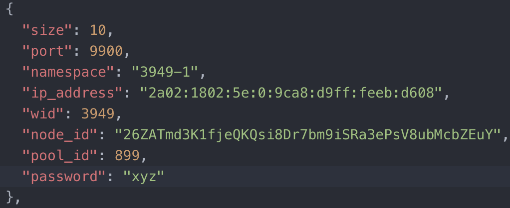
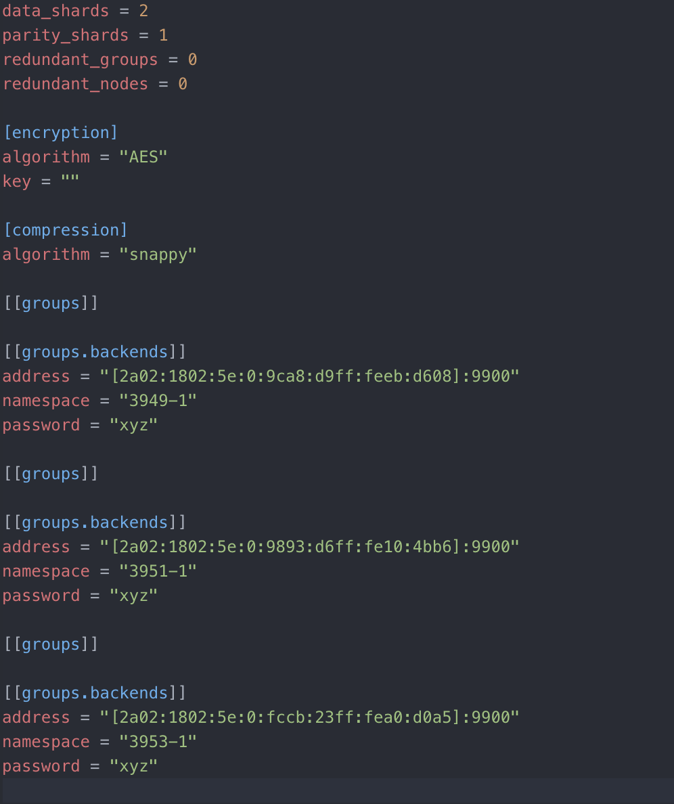

# Manage Storage Nodes

Storage Nodes contain the disk storage (HDD and SSD) capacity that can be used for your workloads. 

Data are stored in Zero-DB's. I

Zero-DB (ZDB) is a very fast and efficient key-value store redis-protocol (mostly) compatible, which makes data persistent inside an always append datafile, with namespaces support.

Update of storage is done in an automated way in your VDC. 
The rule applied for this is the following: ZDBs grow based on the usage, once you reach 70% of your plan it will reserve more storage capacity to a degree where usage is reset 30% after the extension. 

### ZDBS INFO

The button `ZDBS INFO` has all of the infos of ZDBs set up for your needs. 

It contains meta-information about the stored data in the following format: 

With the button `Z-STOR CONFIG` you can download the configuration (in `.toml` format) of Z-STOR. It describes how data is split up into ZDB back end. 

### Z-STOR CONFIG 

Z-STOR stores data in multiple chunks on zdb backends, according to a given policy, retrieves said data, using just the path and the metadata store. 

Zdbs can be removed, as long as sufficient are left to recover the data.
Z-STOR also allows to rebuild the data, loading existing data (as long as sufficient zdbs are left), reencode it, and store it in (new) zdbs according to the current configuration. 

Ìn the below configuration, data is chunked into 3 pieces (each hosted on an available node with indicated IPv6 address), 2 of them being sufficient to recompose the data. 

